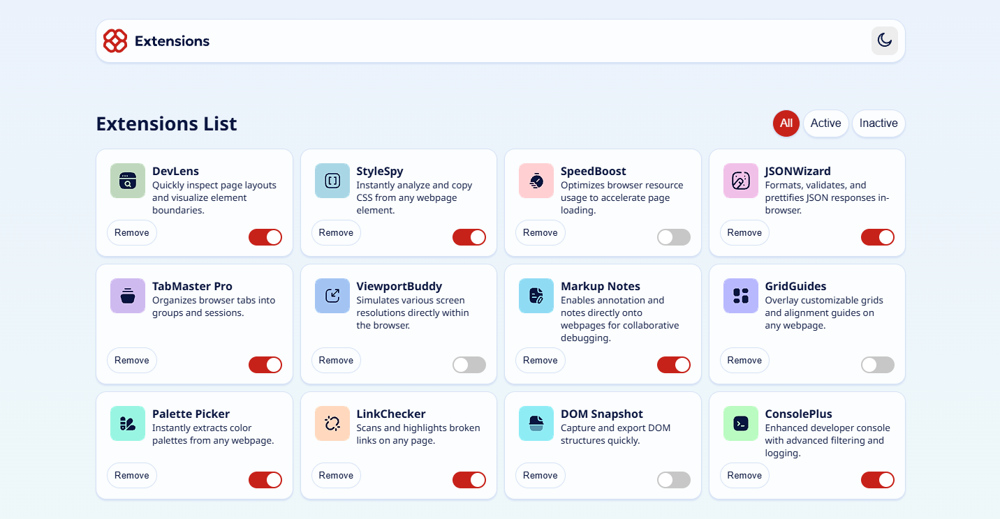
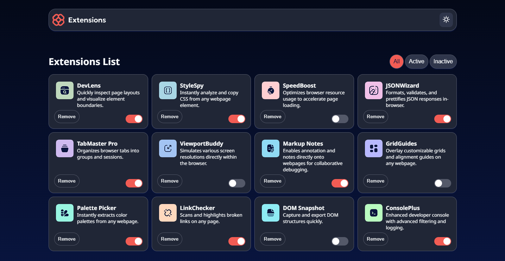

# Frontend Mentor - Browser extensions manager UI solution

This is my solution to the [Browser extensions manager UI challenge on Frontend Mentor](https://www.frontendmentor.io/challenges/browser-extension-manager-ui-yNZnOfsMAp). The project is a responsive browser extension manager built with vanilla HTML, CSS, and JavaScript.

## Overview

### The challenge

The goal was to build an interface where users can:

- View a list of browser extensions loaded from JSON data
- Toggle between light and dark themes
- Filter extensions by all, active, or inactive status
- Remove extensions from the list
- Use the interface comfortably on mobile and desktop screen sizes
- See clear hover and focus states for interactive elements

### Before and after

The challenge preview is shown on the left. My finished implementation is shown on the right in both available themes.

| Before: challenge preview | After: my implementation |
| --- | --- |
|  |  |

### Screenshots

#### Light mode


#### Dark mode



## Links

- Challenge: [Browser extensions manager UI on Frontend Mentor](https://www.frontendmentor.io/challenges/browser-extension-manager-ui-yNZnOfsMAp)
- Solution URL: [Solution URL here](https://www.frontendmentor.io/solutions/responsive-browser-extension-manager-page-using-grids-and-flex-boxes-4eu6XEZSao)
- Live Site URL: [Live Site here](https://elagmae.github.io/FrontendMentor_BrowserExtensionManager/)

## My process

### Built with

- Semantic HTML5 markup
- CSS custom properties
- CSS Grid and Flexbox
- Responsive, mobile-first CSS
- Vanilla JavaScript
- Local JSON data loaded with `fetch`
- `localStorage` for theme and filter preferences
- Local Noto Sans font assets

### What I learned

This was an approachable project overall, but creating the extension cards from the JSON file was the part I found most difficult. In particular, I had to work through how the JavaScript creates and connects each element, how the generated structure should match the CSS layout, and how to load the data correctly.

I am especially proud that I used JSON data, `localStorage`, a theme toggle, and filter buttons for the first time. The theme and filter preferences are restored when the page is opened again:

```js
const currentFilter = localStorage.getItem('filter') || 'all';
localStorage.setItem('theme', 'dark-mode');
```

I also practiced building a responsive card grid and using CSS custom properties to keep the light and dark color themes organized.

### Continued development

- Connect the generated Remove buttons to remove cards from the visible list.
- Connect the generated extension toggles so their active state can be changed by the user.
- Improve accessibility with more descriptive states for the toggle controls.
- Add more robust empty-state handling when a filter has no matching extensions.

### Useful resources

- [Frontend Mentor](https://www.frontendmentor.io/) - The challenge brief and visual designs.
- [MDN: Fetch API](https://developer.mozilla.org/en-US/docs/Web/API/Fetch_API) - Helpful reference for loading the local JSON file.
- [MDN: Web Storage API](https://developer.mozilla.org/en-US/docs/Web/API/Web_Storage_API) - Reference for saving theme and filter preferences.
- [MDN: CSS Grid Layout](https://developer.mozilla.org/en-US/docs/Web/CSS/CSS_grid_layout) - Useful while creating the responsive extension card layout.

## Author

- Frontend Mentor: [@elagmae](https://www.frontendmentor.io/profile/elagmae)

## Acknowledgments

Thanks to Frontend Mentor for providing the design, assets, and a practical project for practicing frontend development.
